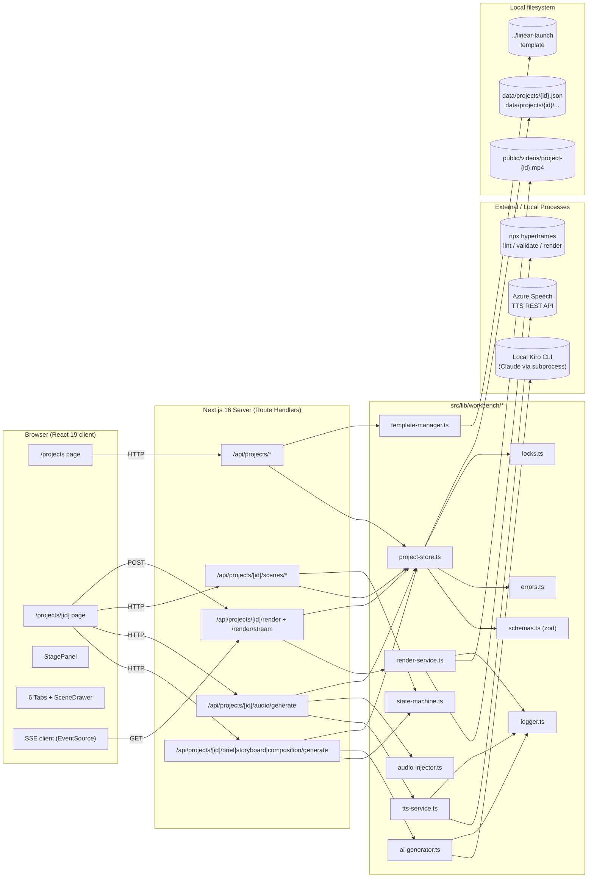
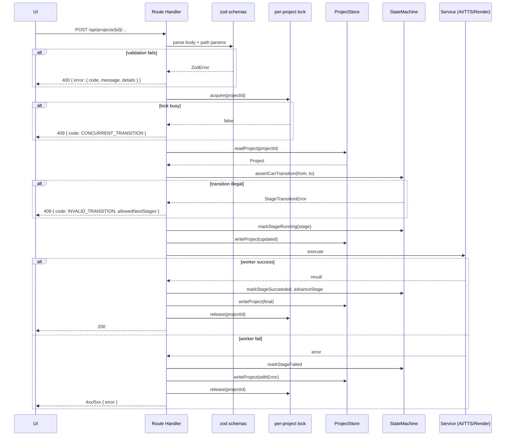
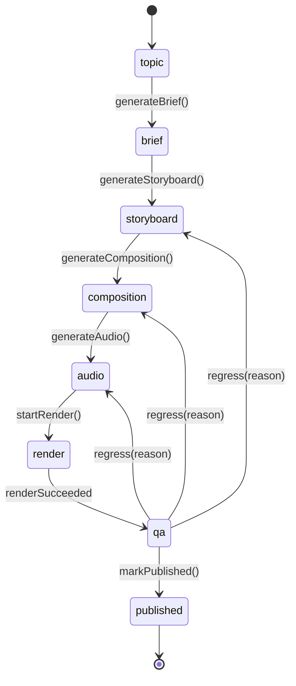
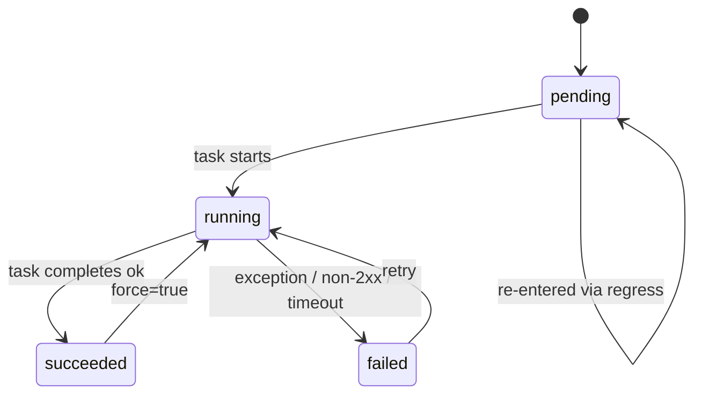
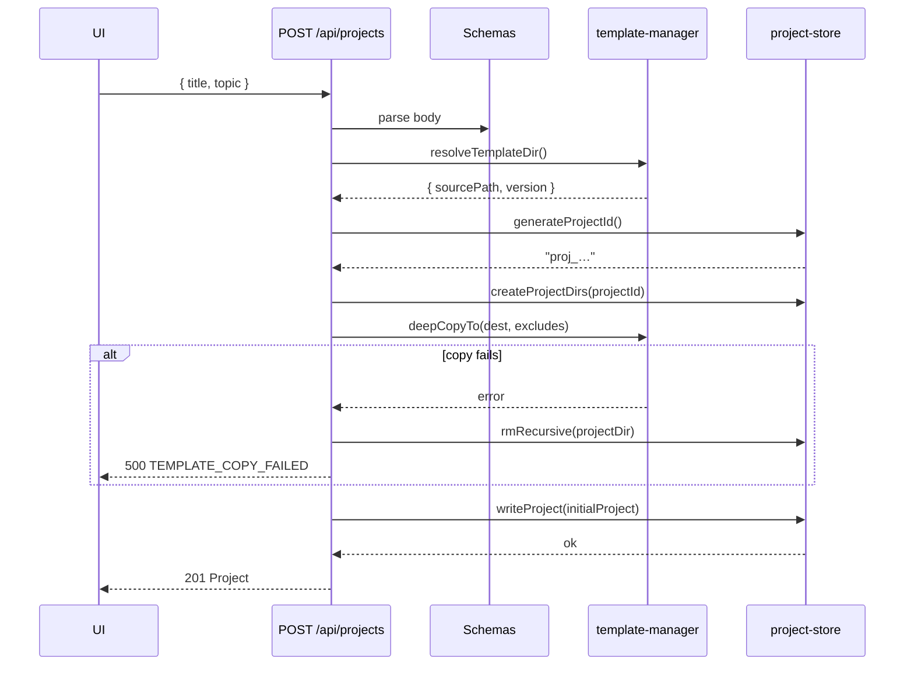
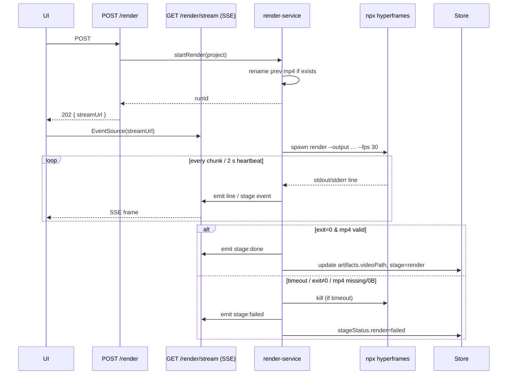

# Design Document — Video Creation Workbench

## Overview

The Video Creation Workbench is a local-first creative tool embedded inside the existing `content-analyzer/web` Next.js 16 app. It drives a single video project from a free-form **topic** to a deliverable **mp4** through an 8-stage state machine: `topic → brief → storyboard → composition → audio → render → qa → published`. Creative steps (Topic→Brief, Brief→Storyboard, Storyboard→HTML, QA→Scene rewrite) are LLM-driven via a local `kiro-cli chat` subprocess; deterministic steps (filesystem initialisation, schema validation, Azure Speech TTS, HTML audio injection, HyperFrames render, preview, stage transition) are pure local code.

Two pages are added:
- `/projects` — list of all projects, with create/delete.
- `/projects/[id]` — detail page with a left-side stage panel and a 6-tab container (`Brief` / `Storyboard` / `HTML` / `Audio` / `Render` / `QA`), plus a right-side Scene drawer.

Storage is pure local filesystem under `content-analyzer/web/data/projects/`. No ORM, no DB. Renders land in `content-analyzer/web/public/videos/`. The HyperFrames composition template comes from `../linear-launch` (sibling of `content-analyzer/web`) and is deep-copied per project so projects never cross-contaminate.

### Design Goals

1. **Filesystem is the database.** Every project fits in a single JSON file plus a directory that can be zipped and handed to `npx hyperframes render` directly.
2. **State machine is authoritative.** Every UI control and API endpoint defers to the stage transition table; nothing mutates stage implicitly.
3. **Failures are recoverable, not catastrophic.** Any write goes temp-file → rename; any HTML mutation is backed up before mutation; any render writes to a side-file before swapping.
4. **PBT-friendly core.** The state machine, scene re-indexer, path sanitiser, project store, and audio injector are pure functions with no external I/O — they are written to be property-tested with `fast-check`.
5. **No new framework.** Reuse Next.js Route Handlers, React 19 Server Components, Tailwind 4, and shadcn/ui already present in the repo. The only new runtime dependency is `zod` (for input validation) and `fast-check` (dev-only, for property tests).

### Non-Goals

- No login, no multi-user, no cloud sync.
- No real-time collaboration.
- No custom render engine — HyperFrames CLI is the only renderer.
- No migration framework (`schemaVersion` is pinned to `1`; future bumps return 409 with a migration hint).

---

## Architecture

### High-Level Component Graph



### Request Lifecycle Pattern

Every mutating endpoint follows the same pattern:



### Separation of Concerns

| Layer | Responsibility | Pure / Impure |
|---|---|---|
| Route Handlers (`src/app/api/**`) | Parse inputs, orchestrate, never do I/O directly | Impure (orchestration) |
| `state-machine.ts` | Transition guards, stage status lifecycle | **Pure** |
| `scene-reindexer.ts` | Re-index scenes after insert/delete/reorder | **Pure** |
| `audio-injector.ts` | HTML string transformation (add/update `<audio>` tags) | **Pure** |
| `path-safety.ts` | Validate `projectId` / `sceneId` regex, reject `..` / NUL | **Pure** |
| `schemas.ts` | zod runtime validation schemas | **Pure** |
| `project-store.ts` | Atomic JSON read/write, directory init, `projectId` generation | Impure (fs) |
| `template-manager.ts` | Resolve `linear-launch` template, deep-copy, sync | Impure (fs) |
| `ai-generator.ts` | LLM calls with retry/timeout, JSON-shape validation | Impure (network) |
| `tts-service.ts` | Azure Speech TTS with exponential backoff, atomic mp3 writes | Impure (network + fs) |
| `render-service.ts` | Spawn `npx hyperframes`, stream logs, SSE events | Impure (subprocess + fs) |
| `locks.ts` | Per-project in-memory mutex | Impure (in-process state) |

The pure modules carry the bulk of the correctness risk and are the primary targets for property-based testing. Impure modules are covered by integration tests with mocks.

---

## Components and Interfaces

### Module Layout

```
content-analyzer/web/src/
├── app/
│   ├── projects/
│   │   ├── page.tsx                      # /projects list page
│   │   ├── [id]/
│   │   │   └── page.tsx                  # /projects/[id] detail page
│   │   └── _components/
│   │       ├── new-project-dialog.tsx
│   │       └── project-row.tsx
│   └── api/
│       └── projects/
│           ├── route.ts                  # POST (create) / GET (list)
│           └── [id]/
│               ├── route.ts              # GET (read) / PATCH (update title/topic) / DELETE
│               ├── brief/generate/route.ts
│               ├── storyboard/generate/route.ts
│               ├── composition/generate/route.ts
│               ├── composition/sync-template/route.ts
│               ├── audio/generate/route.ts
│               ├── render/route.ts              # POST (start)
│               ├── render/stream/route.ts       # GET (SSE)
│               ├── publish/route.ts             # POST (mark published)
│               ├── qa-notes/route.ts            # POST, GET
│               └── scenes/
│                   ├── route.ts                 # POST (create)
│                   └── [sceneId]/
│                       ├── route.ts             # PATCH / DELETE
│                       ├── tts/route.ts         # POST
│                       └── rewrite/route.ts     # POST
├── components/
│   └── workbench/
│       ├── stage-panel.tsx                # left column, 8-stage timeline
│       ├── stage-badge.tsx
│       ├── scene-drawer.tsx
│       ├── tabs/
│       │   ├── brief-tab.tsx
│       │   ├── storyboard-tab.tsx
│       │   ├── html-tab.tsx
│       │   ├── audio-tab.tsx
│       │   ├── render-tab.tsx
│       │   └── qa-tab.tsx
│       ├── diff-view.tsx                  # narration before/after
│       └── log-viewer.tsx                 # tail of {stage}.log
└── lib/
    └── workbench/
        ├── types.ts                       # Project, Scene, Brief, etc.
        ├── schemas.ts                     # zod schemas mirroring types
        ├── errors.ts                      # WorkbenchError, ErrorCode enum
        ├── constants.ts                   # stage list, voice set, timeouts
        ├── state-machine.ts               # transition table + guards
        ├── scene-reindexer.ts             # pure scene-array ops
        ├── audio-injector.ts              # pure HTML mutation
        ├── path-safety.ts                 # projectId/sceneId regex, path validators
        ├── project-store.ts               # atomic JSON I/O + dir init
        ├── template-manager.ts            # linear-launch resolver + deep copy
        ├── ai-generator.ts                # 4 LLM task functions
        ├── tts-service.ts                 # Azure Speech TTS
        ├── render-service.ts              # hyperframes subprocess + SSE
        ├── locks.ts                       # Map<projectId, Promise>
        ├── logger.ts                      # per-stage log file writer + rotate
        └── html-scanner.ts                # pure LLM-HTML danger scan
```

### Key Interfaces

```ts
// src/lib/workbench/state-machine.ts
export type StageTransition = { from: Stage; to: Stage };

export const FORWARD_TRANSITIONS: readonly StageTransition[] = [
  { from: "topic",       to: "brief" },
  { from: "brief",       to: "storyboard" },
  { from: "storyboard",  to: "composition" },
  { from: "composition", to: "audio" },
  { from: "audio",       to: "render" },
  { from: "render",      to: "qa" },
  { from: "qa",          to: "published" },
];

export const BACKWARD_TRANSITIONS: readonly StageTransition[] = [
  { from: "qa", to: "storyboard" },
  { from: "qa", to: "composition" },
  { from: "qa", to: "audio" },
];

export function canTransition(from: Stage, to: Stage): boolean;
export function allowedNextStages(from: Stage): Stage[];
export function resetDownstreamStatus(
  stageStatus: StageStatusMap,
  from: Stage,
): StageStatusMap; // pure; returns new map with target + downstream reset to pending

export function applyTransition(
  project: Project,
  to: Stage,
  reason?: string,
): Project; // pure; returns new project with updated stage/history/statuses

// src/lib/workbench/project-store.ts
export async function createProject(input: CreateProjectInput): Promise<Project>;
export async function readProject(projectId: string): Promise<Project>;
export async function writeProject(p: Project): Promise<void>;           // atomic temp→rename
export async function deleteProject(projectId: string): Promise<DeleteReport>;
export async function listProjects(): Promise<ProjectSummary[]>;
export async function generateProjectId(): Promise<string>;              // retries up to 5

// src/lib/workbench/locks.ts
export async function withProjectLock<T>(
  projectId: string,
  fn: () => Promise<T>,
): Promise<T>; // throws LOCK_BUSY if another holder is present

// src/lib/workbench/ai-generator.ts
export async function generateBrief(project: Project): Promise<Brief>;
export async function generateStoryboard(project: Project): Promise<GeneratedScene[]>;
export async function generateComposition(project: Project): Promise<string /* html */>;
export async function rewriteScene(
  project: Project,
  scene: Scene,
  qaNote: string,
): Promise<{ narration: string; durationSec?: number }>;

// src/lib/workbench/tts-service.ts
export async function synthesizeAll(
  project: Project,
  opts: { force?: boolean },
): Promise<TTSBatchResult>;
export async function synthesizeOne(
  project: Project,
  sceneId: string,
): Promise<Scene>;

// src/lib/workbench/render-service.ts
export type RenderEvent =
  | { type: "stage"; stage: "starting" | "rendering" | "encoding" | "done" | "failed" }
  | { type: "line";  line: string }
  | { type: "heartbeat"; at: string };

export function startRender(project: Project): AsyncIterable<RenderEvent>;
```

---

## Data Models

All types live in `src/lib/workbench/types.ts`. Their runtime equivalents (zod schemas) live in `src/lib/workbench/schemas.ts` and are the single source of truth for API validation.

### `Project`

```ts
export type Stage =
  | "topic" | "brief" | "storyboard" | "composition"
  | "audio" | "render" | "qa" | "published";

export type StageStatusValue = "pending" | "running" | "succeeded" | "failed" | "skipped";

export interface StageStatus {
  status: StageStatusValue;
  startedAt?: string;         // ISO 8601 UTC
  finishedAt?: string;        // ISO 8601 UTC
  error?: {
    code: string;             // ≤64 chars, stable identifier
    message: string;          // ≤500 chars (truncated by store)
  };
  attempts?: number;          // incremented on each run
}

export type StageStatusMap = Record<Stage, StageStatus>;

export interface StageHistoryEntry {
  fromStage: Stage;
  toStage: Stage;
  at: string;                 // ISO 8601 UTC
  reason?: string;            // ≤500 chars
  result: "success" | "failure";
}

export interface ArtifactPaths {
  briefPath: string | null;           // relative, e.g. "brief.json"
  storyboardPath: string | null;      // "storyboard.json"
  compositionDir: string | null;      // "composition"
  indexHtmlPath: string | null;       // "composition/index.html"
  hyperframesJsonPath: string | null; // "composition/hyperframes.json"
  audioPaths: string[];               // ordered by scene.index; default []
  videoPath: string | null;           // public-facing e.g. "/videos/project-xxx.mp4"
}

export interface TemplateSource {
  name: string;                       // "linear-launch"
  version: string;                    // semver | commit-sha | "unknown"
  sourcePath: string;                 // absolute resolved path at creation time
}

export interface QaNote {
  noteId: string;                     // "qan_{8hex}"
  sceneId: string | null;             // null = project-level note
  text: string;                       // ≤2000 chars
  author: "local";
  createdAt: string;                  // ISO 8601 UTC
}

export interface Brief {
  title: string;                      // 1–60
  audience: string;                   // 1–200
  corePoints: string[];               // 3–5 entries, each 1–200
  tone: string;                       // 1–60
  targetDurationSec: number;          // integer 20–180
  suggestedStyle: string;             // 1–200
}

export interface Scene {
  sceneId: string;                    // "sc_{8hex}"
  index: number;                      // 1-based, contiguous
  title: string;                      // 1–40
  narration: string;                  // 1–280 chars at storyboard time
                                      // up to 2000 post-rewrite
  durationSec: number;                // 1–60
  voice: Voice;                       // Azure TTS voice name (see VOICES const for UI picker list)
  audioPath: string | null;           // "assets/scene-{index}.mp3" or null
  qaNote: string;                     // 0–2000
  updatedAt: string;                  // ISO 8601 UTC
}

export type Voice = string; // Azure TTS voice name, e.g. "zh-CN-Xiaochen:DragonHDFlashLatestNeural"

export interface Storyboard {
  scenes: Scene[];                    // length 3–20
}

export interface Project {
  schemaVersion: 1;
  projectId: string;                  // ^proj_[0-9]+_[a-z0-9]{6}$
  title: string;                      // 1–200
  topic: string;                      // 1–500
  locale: "zh-CN" | "en-US";          // default "zh-CN"
  stage: Stage;
  stageStatus: StageStatusMap;
  stageHistory: StageHistoryEntry[];
  brief: Brief | null;
  storyboard: Storyboard | null;
  artifacts: ArtifactPaths;
  qaNotes: QaNote[];
  templateSource: TemplateSource;
  createdAt: string;                  // ISO 8601 UTC
  updatedAt: string;                  // ISO 8601 UTC (monotonic: see Store invariant)
}
```

### `Project` JSON example (shape only)

```json
{
  "schemaVersion": 1,
  "projectId": "proj_1715200000000_a1b2c3",
  "title": "三个理由，今天就开始用 Kiro",
  "topic": "向刚接触 Kiro 的开发者介绍 3 个值得尝试的场景",
  "locale": "zh-CN",
  "stage": "storyboard",
  "stageStatus": {
    "topic":       { "status": "succeeded", "finishedAt": "…" },
    "brief":       { "status": "succeeded", "finishedAt": "…" },
    "storyboard":  { "status": "running",   "startedAt":  "…" },
    "composition": { "status": "pending" },
    "audio":       { "status": "pending" },
    "render":      { "status": "pending" },
    "qa":          { "status": "pending" },
    "published":   { "status": "pending" }
  },
  "stageHistory": [
    { "fromStage": "topic", "toStage": "brief", "at": "…", "result": "success" },
    { "fromStage": "brief", "toStage": "storyboard", "at": "…", "result": "success" }
  ],
  "brief": { /* … */ },
  "storyboard": { "scenes": [ /* 3–20 */ ] },
  "artifacts": {
    "briefPath": "brief.json",
    "storyboardPath": "storyboard.json",
    "compositionDir": "composition",
    "indexHtmlPath": "composition/index.html",
    "hyperframesJsonPath": "composition/hyperframes.json",
    "audioPaths": [],
    "videoPath": null
  },
  "qaNotes": [],
  "templateSource": { "name": "linear-launch", "version": "0.5.5", "sourcePath": "/Users/…/linear-launch" },
  "createdAt": "2026-05-08T15:45:06.106Z",
  "updatedAt": "2026-05-08T15:47:12.440Z"
}
```

### Store Invariants (enforced by `project-store.ts`)

1. `updatedAt` is non-decreasing between successive successful writes (monotonic).
2. A write always goes `tmp → fsync → rename`; readers never observe a half-written file.
3. `schemaVersion === 1`. Loading any other version returns `SCHEMA_VERSION_MISMATCH`.
4. All string fields written through the store have passed the control-char scrub (Requirement 16.3).
5. `projectId` and every `sceneId` satisfy their respective regex; any path constructed from them is asserted to stay under `data/projects/` (resolved absolute path prefix check).

### State Machine



### Per-stage status lifecycle (each stage independently)



### Regression semantics

When `qa → storyboard` (or `composition` / `audio`) is requested:

- `stage` becomes the target.
- `stageStatus[target]` and every stage downstream of `target` are reset to `{ status: "pending" }` (any `error` is preserved in history but removed from the live map).
- `stageHistory` gets an append with `fromStage: "qa"`, `toStage: target`, `reason`, `result: "success"`.
- Artifacts: Brief remains; Storyboard remains but may be edited; Composition HTML, audio mp3s, and mp4 files are **not** auto-deleted — they are considered stale until regenerated. The UI flags them.

### File-system Layout

Per workspace:

```
content-analyzer/web/
├── data/
│   └── projects/
│       ├── proj_1715…_a1b2c3.json
│       ├── proj_1715…_a1b2c3.json.tmp          # transient
│       └── proj_1715…_a1b2c3/
│           ├── brief.json
│           ├── storyboard.json
│           ├── render.log
│           ├── logs/
│           │   ├── topic.log
│           │   ├── brief.log
│           │   ├── storyboard.log
│           │   ├── composition.log
│           │   ├── audio.log
│           │   ├── render.log
│           │   └── qa.log
│           └── composition/
│               ├── index.html
│               ├── index.prev.html              # backup before audio inject
│               ├── index.failed.html            # preserved on LLM+lint fail
│               ├── hyperframes.json             # copied from template
│               ├── meta.json                    # {id,name,createdAt}
│               ├── package.json                 # copied from template
│               ├── fonts/                       # copied from template
│               └── assets/
│                   ├── scene-1.mp3
│                   ├── scene-1.mp3.tmp          # transient
│                   ├── scene-2.mp3
│                   └── …
└── public/
    └── videos/
        ├── project-proj_1715…_a1b2c3.mp4
        ├── project-proj_1715…_a1b2c3.prev.mp4
        └── project-proj_1715…_a1b2c3.poster.jpg
```

Additions to `content-analyzer/web/.gitignore`:

```
data/projects/**
public/videos/project-*.mp4
public/videos/project-*.prev.mp4
public/videos/project-*.poster.jpg
```

### API Contract

All endpoints are Next.js 16 Route Handlers under `src/app/api/projects/**`. Error responses conform to `{ "error": { "code": string, "message": string, "details"?: object } }`. Success responses return the updated `Project` or a resource-specific body as noted.

| Method | Path | Request | Success | Failure codes |
|---|---|---|---|---|
| `POST` | `/api/projects` | `{ title, topic, locale? }` | `201 Project` | `400` `VALIDATION_FAILED`; `500` `TEMPLATE_NOT_FOUND`, `TEMPLATE_COPY_FAILED` |
| `GET`  | `/api/projects` | — | `200 ProjectSummary[]` | — |
| `GET`  | `/api/projects/{id}` | — | `200 Project` | `400` `INVALID_PROJECT_ID`; `404` `PROJECT_NOT_FOUND`; `409` `SCHEMA_VERSION_MISMATCH` |
| `PATCH`| `/api/projects/{id}` | `{ title?, topic? }` | `200 Project` | `400`, `404`, `409` `INVALID_STAGE` (if stage ≠ `topic` and topic changed) |
| `DELETE` | `/api/projects/{id}` | — | `200 DeleteReport` | `400`, `500` `PARTIAL_DELETE` |
| `POST` | `/api/projects/{id}/brief/generate` | `{ force?: boolean }` | `200 Project` | `404`, `409` `INVALID_STAGE`, `409` `STAGE_ALREADY_DONE`, `422` `TOPIC_INVALID`, `502` `LLM_OUTPUT_INVALID`, `504` `LLM_TIMEOUT` |
| `POST` | `/api/projects/{id}/storyboard/generate` | `{ force?: boolean }` | `200 { project, warning? }` | `404`, `409`, `502`, `504` |
| `POST` | `/api/projects/{id}/composition/generate` | `{ force?: boolean }` | `200 Project` | `404`, `409`, `502` `LINT_FAILED` / `VALIDATE_FAILED` / `LLM_OUTPUT_INVALID`, `504` |
| `POST` | `/api/projects/{id}/composition/sync-template` | — | `200 Project` | `409` `TEMPLATE_CONFLICT` with `details.conflicts[]` |
| `POST` | `/api/projects/{id}/audio/generate` | `{ force?: boolean }` | `200 Project` or `207 { project, failures }` | `404`, `409`, `500` `TTS_PROVIDER_UNCONFIGURED`, `500` `AUDIO_INJECT_ROLLBACK` |
| `POST` | `/api/projects/{id}/render` | — | `202 { runId, streamUrl }` | `404`, `409` `INVALID_STAGE` / `RENDER_IN_PROGRESS`, `500` `PREV_RENAME_FAILED` |
| `GET`  | `/api/projects/{id}/render/stream` | SSE, no body | `200` `text/event-stream` | `404`, `409` `NO_RENDER` |
| `POST` | `/api/projects/{id}/publish` | — | `200 Project` | `404`, `409` `CANNOT_PUBLISH` with `details.missing[]` |
| `POST` | `/api/projects/{id}/scenes` | `{ title, narration, durationSec, voice? }` | `200 Project` | `400`, `404`, `409` `STORYBOARD_LIMIT` |
| `PATCH`| `/api/projects/{id}/scenes/{sceneId}` | `Partial<SceneEditable>` | `200 Project` | `400`, `404`, `409` |
| `DELETE`| `/api/projects/{id}/scenes/{sceneId}` | — | `200 Project` | `404`, `409` `STORYBOARD_LIMIT` |
| `POST` | `/api/projects/{id}/scenes/{sceneId}/tts` | `{ force?: boolean }` | `200 Scene` | `404`, `500`, `504` |
| `POST` | `/api/projects/{id}/scenes/{sceneId}/rewrite` | `{ qaNote }` | `200 { scene, compositionRegenRequired }` | `400`, `404`, `409`, `502`, `504` |
| `GET`  | `/api/projects/{id}/qa-notes` | — | `200 QaNote[]` | `404` |
| `POST` | `/api/projects/{id}/qa-notes` | `{ sceneId?: string \| null, text }` | `200 QaNote` | `400`, `404` |

#### SSE event format (render/stream)

```
event: stage
data: {"stage":"rendering","at":"2026-05-08T15:50:00Z"}

event: line
data: {"line":"ffmpeg: encoding 37%","at":"…"}

event: heartbeat
data: {"at":"…"}
```

Heartbeat is emitted every 2 s even when no log lines arrive (satisfies Req 10.7 push frequency). Terminal events are `stage: done` or `stage: failed`, after which the server closes the stream.

### LLM Prompt Contracts

Each LLM task is implemented in `ai-generator.ts` as an async function with a fixed JSON schema on both input and output. The function is responsible for: (a) building the prompt, (b) applying per-call timeout, (c) retry policy, (d) parsing + validating output with zod, (e) writing the parsed result to the `Project`. This section defines the **contract shape**, not the full prompt text.

| Task | Model (default) | Timeout | Retries | Output zod schema |
|---|---|---|---|---|
| `topic → brief` | Claude Sonnet 4.6 via `kiro-cli chat` | 60 s | 2 (3 total) | `BriefSchema` |
| `brief → storyboard` | Claude Sonnet 4.6 via `kiro-cli chat` | 60 s | 1 tolerance-retry (Req 5.5) | `StoryboardOutputSchema` (scenes 3–20) |
| `storyboard → HTML` | Claude Sonnet 4.6 via `kiro-cli chat` (upgrade to Claude Opus 4.7 via `KIRO_MODEL` env for long contexts) | 90 s | 1 repair-retry on lint/validate fail | **Not** validated as JSON; validated by `hyperframes lint` + `validate` + `html-scanner` |
| `qa → scene rewrite` | Claude Sonnet 4.6 via `kiro-cli chat` | 60 s | 0 | `SceneRewriteSchema` (`narration`, optional `durationSec`) |


All four tasks share a common `callLLM(messages, { timeoutMs, maxOutputTokens })` helper. The helper spawns a `kiro-cli chat --no-interactive --trust-all-tools` subprocess, pipes the flattened prompt via stdin, and reads the reply from stdout after stripping ANSI decoration and the `▸ Credits:` footer. Model selection via `KIRO_MODEL` env (default `claude-sonnet-4.6`); binary path via `KIRO_CLI_BIN` env (default `kiro-cli`). No API keys required — the CLI reuses the machine's existing Kiro authentication.

#### Input context each prompt receives

- **Brief**: `{ topic, locale, hints? }`
- **Storyboard**: `{ brief, locale }` + explicit constraint: "total `durationSec` must be within ±15 % of `brief.targetDurationSec`".
- **HTML**: `{ brief, storyboard, hyperframes_rules }` + explicit constraint list (every timed el needs `data-start` / `data-duration` / `data-track-index`, `class="clip"` on visible, GSAP paused & registered on `window.__timelines`, no `Date.now()` / `Math.random()` / fetch).
- **Scene rewrite**: `{ scene, qaNote, prevNarration?, nextNarration?, allowDurationChange }` where `allowDurationChange` is `true` iff `qaNote` contains one of the keywords defined in Req 7.3.

### Sequence: Project Creation



### Sequence: Brief generation with retry

```mermaid
sequenceDiagram
    participant UI
    participant Route as POST /brief/generate
    participant SM as state-machine
    participant AIG as ai-generator
    participant LLM

    UI->>Route: POST (force?)
    Route->>SM: assertCanTransition(topic → brief)
    Route->>SM: markStageRunning("brief")
    loop up to 3 attempts
        Route->>AIG: generateBrief(project, attempt=n)
        AIG->>LLM: callLLM(messages, 60 s)
        LLM-->>AIG: json
        AIG->>AIG: zod.parse(BriefSchema)
        alt parse ok
            AIG-->>Route: Brief
            break
        else parse fail
            AIG-->>Route: InvalidOutput, raw snippet
        end
    end
    alt succeeded
        Route->>Store: writeProject(withBrief, stage=brief)
        Route-->>UI: 200 Project
    else failed after 3
        Route->>Store: writeProject(stageStatus.brief=failed, stage=topic)
        Route-->>UI: 502 { lastSnippet }
    end
```

### Sequence: Render with SSE




---

## Correctness Properties

*A property is a characteristic or behavior that should hold true across all valid executions of a system — essentially, a formal statement about what the system should do. Properties serve as the bridge between human-readable specifications and machine-verifiable correctness guarantees.*

The Workbench contains a substantial core of pure logic — the state machine, scene re-indexer, path validators, schema parsers, audio injector, template filter, error schema, and relative-time formatter — all of which are amenable to property-based testing. The LLM, TTS, and HyperFrames integrations are **not** PBT-appropriate at their I/O boundaries (external services, deterministic external behaviour, high per-iteration cost) and are instead covered by integration tests with mocks.

Property titles reference the requirements they validate. Implementation uses `fast-check` (chosen because it is the standard property-based testing library in the JavaScript / TypeScript ecosystem and integrates cleanly with Vitest).

### Property 1: State transition table is well-formed

*For any* pair of stages `(from, to)` drawn from the 8 × 8 Stage × Stage matrix, `canTransition(from, to)` returns `true` if and only if `(from, to)` appears in `FORWARD_TRANSITIONS ∪ BACKWARD_TRANSITIONS`; furthermore, `allowedNextStages(from)` returns exactly `{ to | canTransition(from, to) }`.

**Validates: Requirements 1.3, 1.5**

### Property 2: Regression resets downstream stages only

*For any* `StageStatusMap` and any target stage `t ∈ {storyboard, composition, audio}`, `resetDownstreamStatus(map, t)` produces a new map where (a) every stage upstream of `t` retains its original status, and (b) `t` together with every stage downstream of `t` has status `"pending"` and no `error` field.

**Validates: Requirements 1.4**

### Property 3: Stage transition is atomic

*For any* `Project p` and any target stage `to` such that `canTransition(p.stage, to)`, the result of `applyTransition(p, to, reason)` satisfies: `result.stage === to`, `result.stageHistory.length === p.stageHistory.length + 1`, the appended entry's `{ fromStage, toStage, reason }` matches the inputs, and no other field of `p` is mutated except `updatedAt` (which is updated per Property 6).

**Validates: Requirements 1.6**

### Property 4: Per-stage status lifecycle preserves stage and orders timestamps

*For any* sequence of status transitions `pending → running → (succeeded | failed)` applied to a single stage via `markStageRunning`, `markStageSucceeded`, `markStageFailed`, the resulting `StageStatus` has (a) `startedAt ≤ finishedAt`, (b) final `status` equal to the last transition's target, and (c) the project's top-level `stage` field unchanged across any failure transition.

**Validates: Requirements 1.8, 1.9, 1.10**

### Property 5: Project and Scene schema round-trip

*For any* conforming `Project` object built from the zod generators, `ProjectSchema.parse(JSON.parse(JSON.stringify(project)))` equals the original project (structural equality); for any JSON object that fails to satisfy `ProjectSchema` (missing required field, out-of-range value, wrong type, bad `schemaVersion`, non-string or empty `voice`, etc.), `ProjectSchema.safeParse` returns `{ success: false }`.

**Validates: Requirements 1.7, 2.2, 2.11, 2.12, 3.1, 3.2, 3.4, 3.5, 3.6, 3.7**

### Property 6: `updatedAt` is monotonic across any mutation sequence

*For any* non-empty sequence of store mutations `m₁, m₂, …, mₙ` applied to a project with mocked clock values `t₁ < t₂ < … < tₙ`, every intermediate written project satisfies `updatedAt_i ≥ updatedAt_{i−1}`, with strict `>` when `mᵢ` changed any field other than `updatedAt` itself.

**Validates: Requirements 2.5**

### Property 7: Atomic writer — coherent reads and no residue on failure

*For any* write to a JSON target file through the atomic-write helper (used by `writeProject`, `writeStoryboard`, `writeBrief`, `writeAudioFile`, `applyTransition`): with a failure injected at any point in the sequence `writeTmp → fsync → rename`, the post-condition holds that (a) every subsequent `readProject` either parses to the previous valid state or the new valid state — never a partial or invalid file — and (b) no `.tmp` residue remains in the target directory. The same property applies in the **inverse** direction for project-creation rollback (Req 8.9): failure at any stage leaves the filesystem in the pre-create state.

**Validates: Requirements 2.7, 2.8, 4.5, 7.4, 8.9, 9.4, 9.7**

### Property 8: Malformed project JSON is rejected, never silently repaired

*For any* byte string that is not a valid UTF-8-encoded JSON matching `ProjectSchema`, `readProject` throws a typed error containing the file path and failure reason; it never returns an empty object, never returns a partially-populated project, and never mutates the file on disk.

**Validates: Requirements 2.9, 2.10**

### Property 9: Scene re-indexing preserves `[1..N]` under any edit sequence

*For any* starting storyboard (3–20 scenes) and any sequence of commands `{ insert(at, scene) | delete(at) | move(src, dst) }` that keeps the scene count within `[3, 20]`, the resulting scene array satisfies: (a) `scenes.map(s => s.index) === [1, 2, …, N]`, (b) every `sceneId` remains unique, (c) every `audioPath` that is non-null still points to `assets/scene-{newIndex}.mp3` for that scene, and (d) the relative order of scenes that were not moved is preserved.

**Validates: Requirements 3.3, 3.9, 5.7, 5.9**

### Property 10: Editing `narration` or `voice` invalidates cached audio

*For any* `Scene s` with arbitrary `audioPath`, `applySceneEdit(s, patch)` where `patch` sets either `narration` or `voice` to a value different from the current one produces a new scene with `audioPath === null`; patches that touch only `title`, `durationSec`, or `qaNote` leave `audioPath` unchanged.

**Validates: Requirements 3.8**

### Property 11: Path safety forbids traversal and honours id regex

*For any* string `s`, `isValidProjectId(s)` is `true` if and only if `s` matches `^proj_[0-9]+_[a-z0-9]{6}$`; `isValidSceneId(s)` is `true` if and only if `s` matches `^sc_[a-z0-9]{8}$`; and for any valid `projectId` and any file name derived from a Scene or artifact, the resolved absolute write path has `path.resolve(DATA_DIR)` as a prefix and contains no `..` segment or NUL byte.

**Validates: Requirements 2.3, 3.2, 8.7, 8.8, 16.4, 16.6**

### Property 12: Control-character scrubber accepts iff input is clean

*For any* string `s`, `scrubControlChars(s)` throws `CONTROL_CHAR_REJECTED` if and only if `s` contains any byte in `{0x00–0x08, 0x0B, 0x0C, 0x0E–0x1F, 0x7F}`; otherwise it returns `s` unchanged.

**Validates: Requirements 16.3**

### Property 13: HTML danger scanner rejects iff forbidden tokens are present

*For any* HTML string `h`, `scanHtml(h)` returns `{ ok: false }` if and only if a case-insensitive substring search over `h` finds any of `<iframe`, `<object`, `<embed`, `fetch(`, `XMLHttpRequest`, `Date.now(`, `Math.random(`; otherwise it returns `{ ok: true }`. The scanner never mutates the input.

**Validates: Requirements 6.3, 16.7**

### Property 14: Audio injection inserts exactly the successful scenes and is perfectly reversible

*For any* composition HTML `h₀`, any storyboard with scenes `s₁..sₙ`, and any subset `S ⊆ {1..n}` marked as successfully synthesised, `injectAudio(h₀, storyboard, S)` returns an HTML `h₁` such that (a) `h₁` contains exactly `|S|` `<audio>` tags whose `src` attributes map bijectively to `assets/scene-{i}.mp3` for `i ∈ S` and whose `data-start` / `data-duration` match each scene's timeline position, (b) no `<audio>` tag corresponds to a scene outside `S`. Furthermore, the rollback invariant holds: if `hyperframes lint` or `validate` fails after injection, restoring `h₀` from the `.prev.html` backup yields a file byte-identical to the pre-injection state.

**Validates: Requirements 9.10, 9.11, 9.12**

### Property 15: Template resolver picks the first existing candidate

*For any* vector of booleans `(envExists, parentExists, grandparentExists)` and any consistent mock filesystem, `resolveTemplateDir()` returns the first of `[env, ../linear-launch, ../../linear-launch]` whose flag is `true` and whose `hyperframes.json` is readable; if none are available, it throws `TEMPLATE_NOT_FOUND` with `details.tried` listing every attempted path.

**Validates: Requirements 8.5, 15.1, 15.2**

### Property 16: Deep-copy exclusion is idempotent and excludes the forbidden set

*For any* source directory listing `F` (modelled as a set of relative paths), the function `selectFilesToCopy(F)` returns a subset `F'` such that (a) no element of `F'` begins with `captures/` or `.thumbnails/`, (b) no element of `F'` ends with `.mp4`, (c) applying `selectFilesToCopy` to `F'` returns `F'` unchanged (idempotence), and (d) every element of `F ∖ F'` matches at least one exclusion rule.

**Validates: Requirements 15.3, 15.4**

### Property 17: `sync-template` merge preserves local work

*For any* project composition directory state `C` containing a potentially modified `index.html` and `assets/` subdirectory, applying `syncTemplate(template, C)` yields a directory `C'` such that (a) `C'.indexHtml === C.indexHtml` (byte-equal), (b) `C'.assets === C.assets` (deep-equal by relative path set and content hash), and (c) `C'.hyperframesJson`, `C'.packageJson`, `C'.fonts` equal the template's corresponding files. If any field in `C.hyperframesJson` diverges from the baseline recorded at creation time, the sync aborts and `C' === C` (no mutation).

**Validates: Requirements 15.6, 15.7**

### Property 18: LLM retry respects the configured attempt budget

*For any* mock LLM that returns a sequence of outputs `o₁, o₂, …, oₖ` where the first `j - 1` outputs fail `OutputSchema.safeParse` and the `j`-th succeeds, `generateBrief` (and analogously `generateStoryboard`, `rewriteScene`) returns successfully if and only if `j ≤ maxAttempts` (3 for brief, 2 for storyboard on schema fail, 1 for rewrite); if `j > maxAttempts` or all outputs fail, it returns `{ error: LLM_OUTPUT_INVALID }` with the last output's snippet truncated to 500 characters. In every branch, the LLM is called exactly `min(j, maxAttempts)` times.

**Validates: Requirements 4.3, 4.4, 5.5, 5.6, 7.7**

### Property 19: Scene-rewrite duration acceptance bounds

*For any* scene with `durationSec = d` and any rewrite proposal with `durationSec' = d'` where `d, d' ∈ [1, 60]`, the rewrite is accepted by `validateSceneRewrite(d, d', qaNote)` if and only if either (a) `qaNote` (case-insensitive) contains one of `{"改时长", "change duration", "缩短", "加长", "shorten", "lengthen"}`, or (b) `|d' - d| / d ≤ 0.3`.

**Validates: Requirements 7.3**

### Property 20: `compositionRegenRequired` flag tracks total-duration drift

*For any* pre-rewrite storyboard with total duration `T` and any single-scene post-rewrite total `T'`, `compositionRegenRequired(T, T')` returns `true` if and only if `|T' - T| / T > 0.10`.

**Validates: Requirements 7.5**

### Property 21: Per-project lock is mutually exclusive

*For any* interleaved sequence of `withProjectLock(projectId, fn)` calls issued concurrently for the same `projectId` (modelled as a command schedule with at most `k` concurrent callers), at most one `fn` body is in flight at any point in simulated time; every other concurrent caller either waits or receives `LOCK_BUSY` (depending on configured policy). Calls on different `projectId`s never block each other.

**Validates: Requirements 1.11, 10.3**

### Property 22: Tab gating matches the stage-to-tab map

*For any* `(tab, stage)` pair from the documented map (Brief≥brief; Storyboard≥storyboard; HTML≥composition; Audio≥composition; Render≥audio; QA≥render), `canEnterTab(tab, stage)` returns `true` if and only if `stage` is at least the tab's minimum stage in the ordering `topic < brief < storyboard < composition < audio < render < qa < published`.

**Validates: Requirements 12.11**

### Property 23: Relative-time formatter falls in the documented buckets

*For any* pair `(now, then)` with `then ≤ now`, `formatRelativeTime(now, then)` returns a label satisfying: `"刚刚"` iff `delta < 60 s`, `"N 分钟前"` with correct `N` iff `60 s ≤ delta < 3600 s`, `"N 小时前"` with correct `N` iff `3600 s ≤ delta < 86400 s`, `"N 天前"` with correct `N` iff `86400 s ≤ delta < 30 × 86400 s`, and the `YYYY-MM-DD` formatted date of `then` iff `delta ≥ 30 × 86400 s`.

**Validates: Requirements 11.1**

### Property 24: Every `WorkbenchError` serialises to the unified error schema

*For any* `WorkbenchError` instance constructed with code `c`, message `m`, and optional `details` object, `error.toResponse()` produces a body that satisfies `ErrorResponseSchema` (i.e. shape `{ error: { code, message, details? } }`), with `code.length ≤ 64`, `message.length ≤ 500` (truncated with `…` suffix if needed), and `details` JSON-serialisable.

**Validates: Requirements 14.1, 14.7**

### Property 25: Log rotation bounds file count and size

*For any* sequence of log writes of total bytes `B` applied to a stage log file with rotation threshold `10 MB` and history limit `3`, after processing the sequence: (a) the active log file's size is `≤ 10 MB`, (b) the directory contains at most `3` rotated history files, and (c) the rotation preserves total retained bytes `≤ 4 × 10 MB` regardless of `B`.

**Validates: Requirements 14.3**

### Property 26: Three-consecutive-failures hint trigger

*For any* `stageHistory` array and any stage `s`, `shouldSuggestRegress(history, s)` returns `true` if and only if the last 3 entries in `history` that involve `s` (either as `fromStage` or `toStage`, filtered by the stage's own run records) all have `result === "failure"`; the function never triggers on an empty or shorter history.

**Validates: Requirements 14.8**

### Property Reflection Notes

Before finalising the list above, the following redundancy consolidations were applied:

1. The "Stage status lifecycle" criteria (Req 1.8 / 1.9 / 1.10) were originally three candidate properties; they share a single state machine and are merged into **Property 4** with a combined "pending → running → (succeeded | failed)" path test.
2. The atomicity requirements at Req 2.7, 4.5, 7.4, 8.9, 9.4, 9.7 all describe the same underlying invariant applied to different writers — consolidated into **Property 7** parameterised over the atomic-write helper, with an explicit note that project-creation rollback is the inverse face of the same invariant.
3. Scene schema (Req 3.1) and per-field bounds (Req 3.4–3.7) collapse into the generic schema round-trip **Property 5**, since zod enforces all bounds uniformly.
4. Path-safety regex (Req 8.7, 8.8), scene-id regex (Req 3.2), and path-traversal safety (Req 16.4, 16.6) all exercise the same path-safety module and are merged into **Property 11**.
5. Audio injection correctness (Req 9.10) and rollback byte-equality (Req 9.11) share the same module and test harness — merged into **Property 14** with two conjuncts.
6. LLM retry properties for Brief (Req 4.3), Storyboard (Req 5.5/5.6), and Scene rewrite (Req 7.7) share one retry-loop implementation — merged into **Property 18** parameterised by `maxAttempts`.
7. HTML danger scan (Req 6.3 constraint enforcement, Req 16.7 pre-write scan) both call the same `scanHtml` function — merged into **Property 13**.
8. Template resolver (Req 8.5) and template-fallback order (Req 15.1, 15.2) merged into **Property 15**.
9. Deep-copy exclusion (Req 15.3, 15.4) — the idempotence conjunct subsumes a separate "exclusion list is applied" property; merged into **Property 16**.

The remaining 26 properties each carry unique validation value. LLM output quality, UI aesthetics, render subprocess behaviour, and external-API response shapes are explicitly **not** PBT targets — they are covered by example-based unit tests and integration tests with mocks (see Testing Strategy).

---

## Error Handling

### Unified Error Schema

Every API error returns a body matching:

```ts
interface ErrorResponse {
  error: {
    code: string;       // stable identifier, ≤64 chars, SCREAMING_SNAKE_CASE
    message: string;    // human-readable, ≤500 chars (truncated with "…")
    details?: Record<string, unknown>;
  };
}
```

Implemented in `src/lib/workbench/errors.ts`:

```ts
export enum ErrorCode {
  // Validation / input (400)
  VALIDATION_FAILED       = "VALIDATION_FAILED",
  INVALID_PROJECT_ID      = "INVALID_PROJECT_ID",
  INVALID_SCENE_ID        = "INVALID_SCENE_ID",
  CONTROL_CHAR_REJECTED   = "CONTROL_CHAR_REJECTED",
  PATH_TRAVERSAL_REJECTED = "PATH_TRAVERSAL_REJECTED",
  PAYLOAD_TOO_LARGE       = "PAYLOAD_TOO_LARGE",          // 413
  TOPIC_INVALID           = "TOPIC_INVALID",              // 422

  // Not found (404)
  PROJECT_NOT_FOUND       = "PROJECT_NOT_FOUND",
  SCENE_NOT_FOUND         = "SCENE_NOT_FOUND",

  // Conflicts (409)
  INVALID_TRANSITION      = "INVALID_TRANSITION",
  STAGE_ALREADY_DONE      = "STAGE_ALREADY_DONE",
  INVALID_STAGE           = "INVALID_STAGE",
  STORYBOARD_LIMIT        = "STORYBOARD_LIMIT",
  CONCURRENT_TRANSITION   = "CONCURRENT_TRANSITION",
  RENDER_IN_PROGRESS      = "RENDER_IN_PROGRESS",
  TEMPLATE_CONFLICT       = "TEMPLATE_CONFLICT",
  SCHEMA_VERSION_MISMATCH = "SCHEMA_VERSION_MISMATCH",
  CANNOT_PUBLISH          = "CANNOT_PUBLISH",
  NO_RENDER               = "NO_RENDER",

  // External service failures (502)
  LLM_OUTPUT_INVALID      = "LLM_OUTPUT_INVALID",
  LINT_FAILED             = "LINT_FAILED",
  VALIDATE_FAILED         = "VALIDATE_FAILED",

  // Timeouts (504)
  LLM_TIMEOUT             = "LLM_TIMEOUT",
  TTS_TIMEOUT             = "TTS_TIMEOUT",
  RENDER_TIMEOUT          = "RENDER_TIMEOUT",

  // Server / fs (500)
  TEMPLATE_NOT_FOUND      = "TEMPLATE_NOT_FOUND",
  TEMPLATE_COPY_FAILED    = "TEMPLATE_COPY_FAILED",
  TTS_PROVIDER_UNCONFIGURED = "TTS_PROVIDER_UNCONFIGURED",
  AUDIO_INJECT_ROLLBACK   = "AUDIO_INJECT_ROLLBACK",
  PREV_RENAME_FAILED      = "PREV_RENAME_FAILED",
  PARTIAL_DELETE          = "PARTIAL_DELETE",
  WRITE_FAILED            = "WRITE_FAILED",
  READ_FAILED             = "READ_FAILED",
  LOCK_BUSY               = "LOCK_BUSY",
  UNKNOWN                 = "UNKNOWN",
}

export class WorkbenchError extends Error {
  constructor(
    public code: ErrorCode,
    message: string,
    public httpStatus: number,
    public details?: Record<string, unknown>,
  ) {
    super(message.length > 500 ? message.slice(0, 497) + "…" : message);
  }
  toResponse(): ErrorResponse { /* … */ }
}
```

Each Route Handler ends with:

```ts
try { /* business logic */ }
catch (e) { return respondWithError(e); }
```

`respondWithError` recognises `WorkbenchError`, `ZodError`, and unknown throws. Unknown errors are logged with stack trace and returned as `{ code: UNKNOWN, message: "Internal error" }` at HTTP 500 — the raw error message is never surfaced to clients.

### Error-to-HTTP-Status Matrix

| Error code prefix / group | HTTP status |
|---|---|
| `VALIDATION_*`, `INVALID_PROJECT_ID`, `INVALID_SCENE_ID`, `CONTROL_CHAR_*`, `PATH_TRAVERSAL_*` | 400 |
| `PAYLOAD_TOO_LARGE` | 413 |
| `TOPIC_INVALID` | 422 |
| `*_NOT_FOUND` | 404 |
| `INVALID_TRANSITION`, `STAGE_ALREADY_DONE`, `INVALID_STAGE`, `STORYBOARD_LIMIT`, `CONCURRENT_TRANSITION`, `RENDER_IN_PROGRESS`, `TEMPLATE_CONFLICT`, `SCHEMA_VERSION_MISMATCH`, `CANNOT_PUBLISH`, `NO_RENDER`, `LOCK_BUSY` | 409 |
| `LLM_OUTPUT_INVALID`, `LINT_FAILED`, `VALIDATE_FAILED` | 502 |
| `LLM_TIMEOUT`, `TTS_TIMEOUT`, `RENDER_TIMEOUT` | 504 |
| `TEMPLATE_NOT_FOUND`, `TEMPLATE_COPY_FAILED`, `TTS_PROVIDER_UNCONFIGURED`, `AUDIO_INJECT_ROLLBACK`, `PREV_RENAME_FAILED`, `PARTIAL_DELETE`, `WRITE_FAILED`, `READ_FAILED`, `UNKNOWN` | 500 |

### Timeout Matrix

| Operation | Per-call timeout | Total per-stage budget |
|---|---|---|
| LLM `topic → brief` | 60 s (Req 4.1) | ≤ 3 × 60 s = 180 s (3 attempts) |
| LLM `brief → storyboard` | 60 s | ≤ 2 × 60 s = 120 s |
| LLM `storyboard → HTML` | 90 s | ≤ 2 × 90 s = 180 s |
| LLM `QA → scene rewrite` | 60 s | 60 s |
| Azure TTS (per scene) | 60 s (Req 9.6) | ≤ 3 × 60 s per scene, scenes processed sequentially |
| `hyperframes lint` | 30 s | 30 s |
| `hyperframes validate` | 30 s | 30 s |
| `hyperframes render` subprocess | 180 s (Req 10.6) | 180 s |
| Stage task overall (wall clock) | 3600 s (Req 1.10) | Hard ceiling; if exceeded, stage is marked `failed` |
| Global API request hard cap | 120 s (Req 14.6) | Synchronous endpoints only; `render` is async via 202 + SSE |

### Logging

Per-project log files live under `data/projects/{projectId}/logs/{stage}.log`. Every entry is a single line of JSON:

```json
{"ts":"2026-05-08T15:45:06.106Z","level":"info","stage":"audio","event":"tts_call","sceneIndex":3,"durationMs":1420,"attempt":1}
```

- Every external call records `durationMs` (Req 14.9).
- Secrets (`AZURE_SPEECH_KEY`) are never logged (Req 9.9). The logger injects a redaction pass that replaces any environment variable value longer than 16 chars with `***REDACTED***` as a defensive measure.
- Rotation policy: when `{stage}.log` exceeds 10 MB, it is renamed to `{stage}.log.1`; existing numbered files shift up, and anything beyond `{stage}.log.3` is deleted (Req 14.3).

### SSE Event Types

| Event | Payload | Trigger |
|---|---|---|
| `stage` | `{ stage: "starting" \| "rendering" \| "encoding" \| "done" \| "failed", at }` | Subprocess start, stdout regex match, exit |
| `line` | `{ line: string (≤500 chars), at }` | Each stdout/stderr line |
| `heartbeat` | `{ at }` | Every 2 s if no `line` event occurred |
| `error` | `{ code, message }` | Terminal failure, immediately before stream close |

The SSE endpoint sets `Cache-Control: no-cache, no-transform` and `Connection: keep-alive`. It flushes every event immediately by writing `\n\n` terminators to the response stream. Reconnection is not automatic on the server — the client calls `EventSource` which retries per standard browser behaviour; however, because render state is observable from `GET /api/projects/{id}` anyway, the UI uses the REST endpoint as the source of truth and SSE purely for UX progress updates.

### UI Error Surfacing

- Stage Tab header (Req 14.4): shows red banner with `error.code` and first 200 chars of `error.message`, plus a "查看完整日志" link that opens a log viewer popover (tail of 500 lines).
- Project list page (Req 14.7): each row's stage badge turns red if `stageStatus[currentStage].status === "failed"` and shows a tooltip with the error code.
- After 3 consecutive failures for the same stage (Req 14.8), the Stage Tab shows a "建议回退上一阶段重做" hint inline — never auto-regresses.

### Concurrency Model

The Next.js dev server runs one Node.js process; the production `next start` also runs a single process by default. The Workbench relies on an in-process mutex map `Map<projectId, Promise>` in `locks.ts` to serialise:

- any POST/PATCH/DELETE on `/api/projects/{id}/**` (acquires the lock at route entry)
- the render subprocess lifecycle (held for the entire lifetime of the child process)

`withProjectLock(projectId, fn)` enforces:

1. If the lock is free, set it to `fn()`'s promise and release on completion (success or failure).
2. If the lock is held, throw `LOCK_BUSY` (mapped to HTTP 409 `CONCURRENT_TRANSITION`).
3. Different `projectId`s use separate lock slots and never block one another.

Per-project locks satisfy Req 1.11 (stage transitions) and Req 10.3 (render in progress). There is no cross-project global lock — the assumption is that filesystem I/O under `data/projects/{projectId}/**` stays within one directory per project, so cross-project writes can proceed in parallel safely.

### Security & Input Validation Pipeline

All inbound data flows through this pipeline before touching fs / external services:

```mermaid
flowchart LR
    Req[HTTP Request] --> Size[Size limit<br/>1 MB / 4 MB]
    Size --> Zod[zod.parse<br/>type + length + range]
    Zod --> Scrub[control-char scrub<br/>ASCII 0x00-0x1F, 0x7F]
    Scrub --> Path[path safety<br/>regex + no '..' + no NUL]
    Path --> Store[project-store / service]
    Zod -.reject.-> Err400[400 VALIDATION_FAILED<br/>with details[]]
    Scrub -.reject.-> Err400b[400 CONTROL_CHAR_REJECTED]
    Path -.reject.-> Err400c[400 INVALID_PROJECT_ID /<br/>PATH_TRAVERSAL_REJECTED]
    Size -.reject.-> Err413[413 PAYLOAD_TOO_LARGE]
```

Body size limits are enforced via the `request.arrayBuffer()` length check inside each Route Handler (Next.js 16 does not enforce a global limit for Route Handlers). Free-text fields (`narration`, `qaNote`, LLM-generated strings) allow up to 20000 chars; other strings are capped at 4000.

LLM-returned HTML additionally passes through `scanHtml()` (Req 6.3, 16.7) before any write. The scanner is a pure, case-insensitive substring check with zero allocations beyond the token list — no HTML parser is invoked, so the check is cheap and deterministic.

Absolute-path safety uses `path.resolve(DATA_DIR, relativePath)` and asserts the result starts with `path.resolve(DATA_DIR) + path.sep`. Any `..` segment, absolute path prefix, or NUL byte in the input short-circuits with `PATH_TRAVERSAL_REJECTED`.

---

## Testing Strategy

### Stack

- **Unit / integration tests**: `vitest` (already in `package.json`), `@testing-library/react` for components.
- **Property-based tests**: `fast-check` (new dev dependency — the de-facto standard for PBT in the TypeScript ecosystem and integrates with Vitest via plain `test()` wrappers).
- **End-to-end smoke (optional, MVP-deferred)**: a single Playwright spec that walks `/projects → new project → each stage → render → publish` against mocked LLM and TTS endpoints. Can land after Phase 1.

New runtime dependency (also covered by the state from the Correctness Properties section):

```json
{
  "dependencies": { "zod": "^3.23.8" },
  "devDependencies": { "fast-check": "^3.22.0" }
}
```

`zod` is the only new runtime dep; it is small (~10 KB gz) and widely adopted in the Next.js ecosystem. `fast-check` is dev-only.

### What to Test Where

| Module | Unit tests | Property tests | Integration tests |
|---|---|---|---|
| `state-machine.ts` | transition enum check | Properties 1–4 | — |
| `scene-reindexer.ts` | simple insert/delete examples | Property 9 | — |
| `audio-injector.ts` | fixture-based HTML in/out | Property 14 | — |
| `path-safety.ts` | boundary cases | Property 11 | — |
| `schemas.ts` | happy-path parses | Properties 5, 24 | — |
| `errors.ts` | error → response mapping | Property 24 | — |
| `project-store.ts` | read/write golden file | Properties 6, 7, 8 (with fs mock) | fs-based test against tmp dir |
| `template-manager.ts` | fallback order examples | Properties 15, 16, 17 | tmp-dir copy test |
| `ai-generator.ts` | happy-path with mocked LLM | Property 18 | mocked kiro-cli subprocess (vi.mock node:child_process) |
| `tts-service.ts` | per-scene happy path | Property 7 (atomic mp3 write) | mocked Azure Speech REST (MSW) |
| `render-service.ts` | spawn mocked | — (behaviour tied to child_process) | mocked `spawn` + event recorder |
| `locks.ts` | basic acquire/release | Property 21 | — |
| `logger.ts` | json line format | Property 25 | fs-based rotation test |
| `html-scanner.ts` | known forbidden + safe | Property 13 | — |
| Route handlers `app/api/**` | golden requests per endpoint | — | Next.js `NextRequest` tests with mocked modules |
| Pages `app/projects/**` | — | Property 22, 23 (pure UI helpers) | Testing-library render tests |

### Property-based Test Configuration (fast-check)

Every property test MUST:

1. Run at least **100 iterations** (fast-check default is 100; we keep the default explicit per property).
2. Be tagged with a code comment referencing the design property:

   ```ts
   // Feature: video-creation-workbench, Property 3: Stage transition is atomic
   ```

3. Use deterministic seed from `fc.configureGlobal({ seed: 0xBEEF })` in `src/test/setup.ts` so CI failures are reproducible.
4. For concurrency-related properties (Property 21), use `fc.scheduler()` to generate command interleavings.

One property test may be tagged with multiple consolidated requirement references (e.g., `Validates: Requirements 2.7, 4.5, 7.4, 8.9, 9.4, 9.7` for the atomic-writer property).

### Integration Tests

- **LLM (kiro-cli)**: mocked by stubbing `child_process.spawn` with a scripted reply queue. No real subprocess invocations in CI.
- **Azure Speech TTS**: mocked at the HTTP layer with MSW (`msw` is already a zero-cost dev dep we can add). No real API calls in CI. One optional "live" test behind `WORKBENCH_LIVE=1` env flag for local smoke.
- **HyperFrames CLI**: mocked by stubbing `child_process.spawn`; the tests inject a fake EventEmitter with pre-recorded stdout/exit codes. A separate "live" test behind the same env flag runs against the real `../linear-launch` template.
- **Filesystem**: every store / template test uses a unique `tmp/` directory under `os.tmpdir()` and cleans up in `afterEach`. No test touches `data/projects/` in the real workspace.

### Coverage Targets (informal)

- Pure modules (`state-machine`, `scene-reindexer`, `audio-injector`, `path-safety`, `schemas`, `errors`, `html-scanner`, `logger`): **95%+ line coverage** (enforced locally, not CI-blocking).
- Services with mocked I/O: **≥80% line coverage**.
- UI components: visual render + critical-path interaction tests (Create dialog, Delete confirm, Scene drawer save, Render SSE wiring). Full-coverage is not a goal.

### What Is Explicitly NOT Tested

- **LLM output quality** (e.g., "brief is interesting") — out of scope for automated tests; assessed via manual review.
- **HyperFrames CLI correctness** — trusted upstream. Only our invocation and post-processing logic are tested.
- **Real kiro-cli output quality** — not asserted in CI (binary must be installed and authenticated for live smoke).
- **Browser video decoder correctness** (Req 17.3) — asserted by `ffprobe` reporting non-zero `nb_read_frames` in an integration test; not by actually decoding via Chromium.

---

## Existing Code Touchpoints

### Reused (unchanged)

| Path | Reason |
|---|---|
| `src/app/layout.tsx` | Workbench pages inherit the root layout, fonts, theme, metadata |
| `src/app/globals.css` | Tailwind v4 base, shadcn CSS variables |
| `src/components/ui/button.tsx` | Workbench reuses the existing button primitive |
| `src/components/ui/input.tsx` | Reused in Scene drawer and new-project dialog |
| `src/components/ui/badge.tsx` | Reused for stage-status badges |
| `src/components/ui/tabs.tsx` | Reused for the 6-tab container on the detail page |
| `src/components/ui/separator.tsx` | Reused in list rows / stage panel |
| `src/components/sidebar.tsx` | Extended (not rewritten) with a "视频工作台" nav link to `/projects` |
| `src/lib/utils.ts` | `cn()` helper reused by all new components |
| `src/test/setup.ts` | Adds fast-check seed; otherwise unchanged |

### Conventions Inherited (not new code, but followed)

- JSON-per-file storage under `data/<domain>/<id>.json` — matches the existing `data/history/` and `data/plans/` pattern in `src/lib/history.ts` and `src/lib/plans.ts`. Workbench's `src/lib/workbench/project-store.ts` uses the same `ensureDir → tmp-write → rename` shape.
- Route Handlers under `src/app/api/<domain>/…/route.ts`, following the existing `src/app/api/analyze/` and `src/app/api/plans/` layout.
- ID generation pattern `{prefix}_{timestamp}` — extended to `{prefix}_{timestamp}_{6hex}` for Workbench to satisfy Req 2.3's uniqueness requirement within a single millisecond.
- Client components opt in via `"use client"` at the top of the file; server components are the default. This follows the pattern used by `src/app/history/page.tsx`.

### New Modules

All new code lives under:

- `src/lib/workbench/**` — all backend business logic (pure + impure, as listed in the Module Layout above).
- `src/app/projects/**` — the two pages and local `_components/`.
- `src/app/api/projects/**` — all REST route handlers.
- `src/components/workbench/**` — shared UI components used by both pages.

No existing files under `src/lib/` or `src/app/api/` are modified by the Workbench feature. The only existing file that is edited is `src/components/sidebar.tsx` (to add a nav link) and `.gitignore` (to add Workbench data / video patterns, Req 8.11). `package.json` is edited to add `zod` and `fast-check`.

### Environment Variables (new)

| Variable | Purpose | Required? | Default |
|---|---|---|---|
| `AZURE_SPEECH_ENDPOINT` | Azure Speech TTS endpoint URL | Yes (for audio) | — |
| `AZURE_SPEECH_KEY` | Azure Speech subscription key | Yes (for audio) | — |
| `KIRO_CLI_BIN` | Path to the kiro-cli binary | No | `"kiro-cli"` |
| `KIRO_MODEL` | Model id, see `kiro-cli chat --list-models` | No | `"claude-sonnet-4.6"` |
| `HYPERFRAMES_TEMPLATE_DIR` | Overrides template search | No | (auto-detected) |
| `WORKBENCH_LIVE` | Enables live LLM/TTS integration tests | No (CI leaves unset) | `0` |

---

## Open Decisions

### OD-1: LLM provider for `ai-generator.ts`

**Status**: RESOLVED — using local Kiro CLI subprocess.

Originally proposed options were: reusing the existing internal `/api/video` flow, direct OpenAI SDK with JSON-mode, or direct Anthropic SDK. The chosen path is **local Kiro CLI subprocess** (`kiro-cli chat --no-interactive --trust-all-tools`).

**Rationale**:
- The workbench is intentionally local-only. Reusing the machine's existing Kiro authentication eliminates API key management and the associated `.env` surface area.
- Kiro's credit budget subsumes per-task vendor billing — no separate usage tracking is needed.
- Claude Opus 4.7's 1M context window is available (via `KIRO_MODEL` override) for HTML composition on long storyboards where Sonnet's context might be tight.
- Strict-JSON output is enforced by an explicit instruction in the flattened prompt plus `parseJsonLoose` (strips stray markdown fences) and a zod `safeParse` on the parsed shape — the same validation posture JSON-mode would have given us, without a vendor dependency.

**Tradeoffs**:
- Output quality depends on `kiro-cli` being installed and authenticated on the host machine. Deployment to a fresh environment requires `kiro-cli` provisioning (out of scope for MVP).
- Network or auth failures surface as non-zero subprocess exit codes rather than HTTP status codes. `respondWithError` maps both to `LLM_OUTPUT_INVALID` uniformly, so downstream error handling is unaffected.
- Per-call latency is slightly higher than direct HTTP due to process-spawn overhead (~150 ms on M4 Pro), but well within the 60 s / 90 s per-task budgets.

### OD-2: Whether to gate publish on mp4 file re-check

Req 17.5 says publish requires `artifacts.videoPath` non-null AND the file exists AND size > 0. The design currently performs the file stat check at publish time. Alternative: trust `artifacts.videoPath` and skip the stat (simpler). **Recommendation**: keep the stat check. Cost is one `fs.stat` call per publish request; the guarantee (publish never succeeds with a missing mp4) matches the user-level contract in Req 17.3.

### OD-3: Client-side vs server-side pagination on `/projects`

Req 11.9 requires pagination at 20/page. The design uses **client-side pagination**: `GET /api/projects` returns all `ProjectSummary` records (sorted by `updatedAt` desc), and the page slices 20 into the DOM. This is adequate up to a few hundred projects (each summary is ~500 bytes). If projects grow beyond ~1000, a follow-up should introduce `GET /api/projects?limit=20&cursor=…` with a server-side cursor. **Recommendation**: stay client-side for MVP; revisit when the first user hits 200 projects.

### OD-4: SSE vs polling for render progress

Req 10.7 mandates push frequency of "at least every 2 s". **SSE** satisfies this naturally and is lighter than WebSocket. An alternative is polling `GET /api/projects/{id}` every 2 s, but it wastes ~10× more bytes per update and blocks other requests on the per-project lock. **Recommendation**: SSE for render-progress UX; REST `GET /api/projects/{id}` remains the source of truth so a dropped SSE connection does not leave the UI stuck.

### OD-5: Whether storyboard edits stay inside `storyboard` stage or allow live edits in `composition+`

Req 5.10 allows PATCH/POST/DELETE on scenes when stage ∈ `{storyboard, composition, audio, render, qa}`. A single scene edit after `composition` invalidates the HTML (and after `audio`, also the mp3s). The design chooses to **not** auto-regress stage on such edits — it instead marks the stageStatus of downstream stages `failed` implicitly (via `audioPath = null` for `voice`/`narration` edits) and surfaces a UI warning. This matches Req 7.4 semantics for rewrites and keeps edits non-destructive. **Recommendation**: keep as designed. A manual "regenerate downstream" button in each tab handles the regression path explicitly.

### OD-6: How aggressively to persist LLM responses for debugging

The design writes `brief.json` and `storyboard.json` only after successful zod validation. Failed raw responses are recorded in `logs/{stage}.log` (first 500 chars, Req 4.4) but not kept as separate files. **Alternative**: keep the last N raw responses per stage under `logs/{stage}.raw.{n}.txt` for offline post-mortem. **Recommendation**: defer the raw-response store; logs are sufficient for MVP and avoid surprises around log rotation.

### OD-7: Whether to pin `hyperframes` version

`linear-launch/package.json` pins `hyperframes@0.5.5` via `npx --yes hyperframes@0.5.5`. The Workbench's `render-service.ts` currently calls `npx hyperframes <cmd>` without a version pin. **Recommendation**: pin to the same version as the template (`npx --yes hyperframes@0.5.5 <cmd>`) so rendering is reproducible regardless of whatever is cached globally. The pin can live in a `HYPERFRAMES_CLI_VERSION` constant in `src/lib/workbench/constants.ts`.

### OD-8: Where `linear-launch` lives in production-like setups

The template is located outside `content-analyzer/web/`. In a production build this path is only relevant at runtime (template copy happens at project creation, not at build time), so Vercel-style deployment is not blocked — but the current MVP is local-only, so this is not an active concern. Recorded here so it's not forgotten later.
